<div align="center">

# 🌍 IMEJapanese

### I'm e-Japanese that helps keyboard inputs of Japanese characters. 

### IME 설치없이 한글CAPS 입력모드에서 일본어 입력 지원


</div>

<br>

## 💡 개발 동기 (Why IMEJapanese?)

#### 🎯 1. 한글/Caps 상태를 창의적으로 재활용

> "한글 입력 상태에서 Caps Lock이 무의미한데, 이걸 일본어 문자 입력 모드로 활용할 수 있지 않을까?"

- **기존 문제**: Caps Lock은 영어에서만 의미 있음

- **새로운 활용**: 한글/Caps 상태에서 **일본어**의 입력 모드로 재구성

- **효과**: 일본어 IME 설치없이 일본어 입력 모드 지원

#### 🎯 2. 한글의 글자 조합 원리를 일본어에 적용

> "한글의 자음+모음 글자조합 원리를 일본어 문자에도 적용할 수 있지 않을까?"

- **한글 원리**: 자음(19개) + 모음(21개) → 한글 소리글자 조합

- **일본어 응용**: 대표자음(12자) + あ행모음(5자) → 조합글자(60자)

- **결과**: 3가지 종류의 입력 모드 개발 (**일본어1_조합형_대표글자, 일본어2_조합형_최빈글자, 일본어3_3Layer** )

- **효과**: 일본어에 정통하지 않은 사용자도 직관적인 입력 가능


<br>

## ✨ 주요 기능 (Key Features)

### 1️⃣ 입력 상태별 5가지 색상 테마 제공

### 2️⃣ 한글/CAPS 상태에서 3가지 입력 모드 선택

- 입력 모드가 변경되면 트레이 아이콘의 색깔이 **즉각적으로** 변합니다.

- **한자키** (RCtrl): 영어 소문자 ↔ 한글CAPS 입력모드

<div align="center">

| 입력 상태 | 포인터 색상 | 트레이 문자 | 설명 |
|:---|:---|:---:|:---|
| **영어 소문자** | $\color{white}\Large\blacktriangle$ White | $\color{gray}\large\boldsymbol{e}$ | 영어 소문자 입력 (CAPS Off) |
| **영어 대문자** | $\color{DeepSkyBlue}\Large\blacktriangle$ DeepSkyBlue | $\color{deepskyblue}\large\textbf{E}$ | 영어 대문자 입력 (CAPS On) |
| **한글** (기본) | $\color{red}\Large\blacktriangle$ Red | $\color{red}\large\textbf{K}$ | 한글 입력 (Caps Off) |
| **일본어1** (조합형) | $\color{lime}\Large\blacktriangle$ Lime | $\color{lime}\large\textbf{J}$ | **한글CAPS**, 대표자음+모음 조합 |
| **일본어2** (조합형) | $\color{lime}\Large\blacktriangle$ Lime | $\color{lime}\large\textbf{J}$ | **한글CAPS**, 최빈자음+모음 조합 |
| **일본어3** (3-Layer) | $\color{lime}\Large\blacktriangle$ Lime | $\color{lime}\large\textbf{J}$ | **한글CAPS**, 3Layer에 76자 배치 |
| **Japanese IME** | $\color{lime}\Large\blacktriangle$ Lime | $\color{lime}\large\textbf{j}$ | 일본어 IME 설치시 |

</div>

<div align="center">

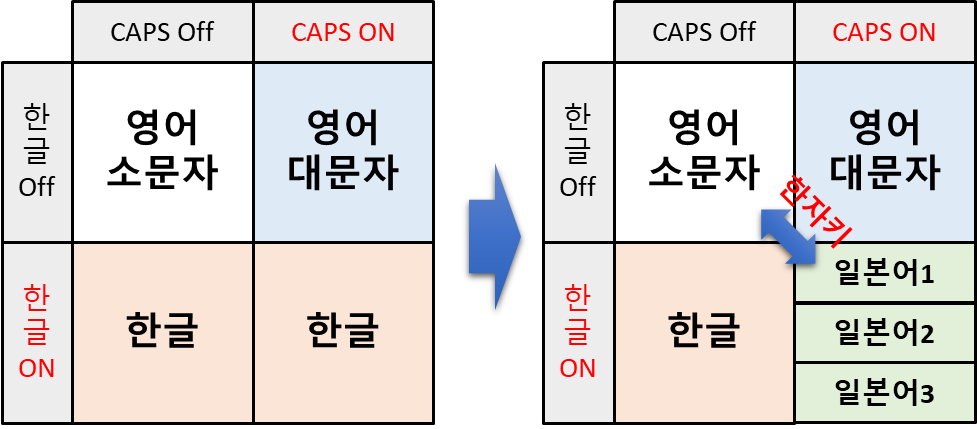

</div>

### 3️⃣ 온라인/오프라인 일본어 한자변환 기능 제공

- 트레이 메뉴에서 **"Mozc 오프라인 한자변환"** 또는 **"Google 온라인 한자변환"** 선택 기능 제공

- "Mozc 오프라인 한자변환" 선택시, `mozc_dict_connect.db` 파일을 1회 온라인 다운로드 필요함

- "Google 온라인 한자변환" 선택시, 온라인으로 Google CGI API for Japanese Input 기능을 제공함

- 일본어 문자열을 입력하고 또는 입력한 문자열을 선택하고, spacebar를 눌러서 일본어 단어를 한자로 변환

### 4️⃣ 현재 입력모드의 키보드 배열창을 실시간으로 표시

- 트레이 메뉴에서 **"일본어 키보드 배열창"** 선택시 해당 키보드 배열 그림을 보여줌 (Always On Top)

- 한자키로 입력모드/Layer 전환시 해당 키보드 배열 그림으로 변경함

- Shift키 반응하여 키보드 배열 그림 변경

### 5️⃣ 입력문자 표시창으로 문자 입력확인 및 학습보조

- 트레이 메뉴에서 **"일본어 입력문자 표시창"** 선택시 키보드로 입력한 일본어 문자를 화면에 표시함

- 일본어1 조합모드에서 "대표자음 + あ행모음 → 조합문자" 변환 표시

- 일본어2 조합모드에서 "최빈자음 + あ행모음 → 조합문자" 변환 표시

- 일본어에서 HK/YN 전환키 사용시 글자 전환 표시

- 한자키로 입력모드/Layer 전환시 현재 입력모드/Layer 표시

### 6️⃣ 삼성전자 갤럭시북5 Copilot키의 한자키 적용/복원 키맵핑 기능 제공

- 트레이 메뉴에서 **"한자키 적용/복원 키맵핑"** 기능을 제공한다.

- 삼성전자 갤럭시북5은 다음과 같이 copilot키를 한자키와 겸용으로 사용한다.

  * 그냥 눌렀을 때: Copilot 실행 매크로 신호 (Win + Shift + F23)

  * Fn + 눌렀을 때: 한자키 신호 (IME Kanji)

- Sharpkeys 앱을 사용하면 다음의 키맵핑으로 Registry를 수정하여 한자키를 사용할 수 있다.

  * 기존 Copilot 키 선택: "Function : F23 (00_6E)"

  * 한자키로 키맵핑 : "Unknown: 0xE071 (E0_71)"

### 7️⃣ 트레이 아이콘 **클릭**하여 메뉴 선택하고, 옵션 On/Off

<div align="center">

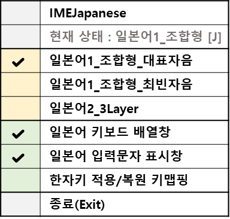

</div>

<br>

## 💡 사용팁 (Tips)


### 1️⃣ 일본어1_조합형_대표자음

1. 트레이 메뉴에서 "일본어1_조합형_대표자음" 선택 (한글 입력 모드 + CAPS Lock On)

2. 자음글자(왼손)과 모음글자(오른손)을 조합하여 히라가나/가타카나 글자를 생성함.

- 대표자음(12자) + あ행모음(5자) → 조합글자(60자) 

- 예시: さ + い → し

- 대표자음 : 12개의 행(かさたなはまらがざだばぱ)에서 각 행을 대표하는 あ단 글자. 각 행은 5개의 글자로 구성됨. 

- あ행모음 : あいうえお 5자

- 두번째 글자가 あ행모음이 아닌 경우에는 첫번째 입력한 대표자음을 입력글자로 확정함.

3. 대표자음을 あ단으로 선정하고, 문자 사용 빈도를 고려하여 위치를 정함.

<div align="center">

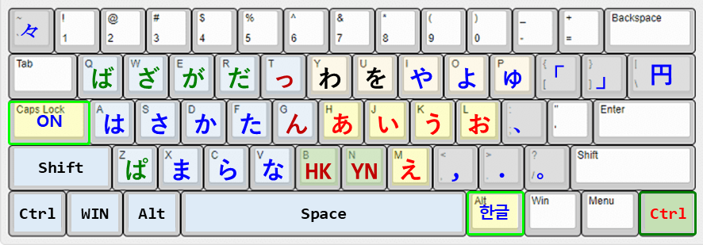
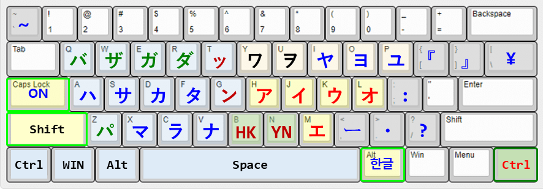

</div>

4. 인체공학적 자판 배치 및 일본어 특수 기호 추가

- 왼손 자음 글자는 50음도의 역방향으로, 오른손 모음 글자는 순방향으로 배열함. 

- 단, 사용빈도를 고려하여 あいうおえ, やよゆ로 순서를 바꾸어 배열함.

- 일본어에서 자주 사용되는 기호 (¥ ・ 、 。 ー)를 배치함.

<div align="center">

|영어|일본어|영어Shift|일본어Shift|
|:--:|:--:|:--:|:--:|
| \ | ¥ | \| | \| |
| ; | ・ | : | : |
| , | 、 | \< | , |
| . | 。 | \> | . |
| \/ | ー | ? | \/ |

</div>

5. 한자키/HK/YN 전환기능

- **한자키** (RCtrl): 일본어 ↔ 영어소문자 입력모드 전환기능

- **HK** 전환키(B): 히라가나(H) ↔ 가타카나(K)

- **YN** 전환키(P): 청음 → 탁음 → 반탁음 → 작은글자 → 청음

** 다수의 글자를 선택하고 HK/YN키를 누르면, 첫번째 글자가 전환되는 글자와 동일한 유형으로 글자들이 전환된다.

<div align="center">

|청음|탁음|반탁음|작은글씨|동일유형|
|:---:|:---:|:---:|:---:|:---|
|**さ**|**ざ**|-|-|か행(き,く,こ),さ행,た행|
|**な**|**ば**|**ぱ**|-|は행(はひふへほ)|
|**つ**|**づ**|-|**っ**|つ,う,か,け|
|**や**|-|-|**ゃ**|あ행(あいうえお),やゆよ,わ|
|**ん**|-|-|-|な행,ま행,ら행,を,ん|

</div>

### 2️⃣ 일본어2_조합형_최빈자음

1. 트레이 메뉴에서 "일본어2_조합형_최빈자음" 선택 (한글 입력 모드 + CAPS Lock On)

2. 일본어1_조합형(대표자음)과 동일한 방식이지만, 각행의 대표자음을 사용 빈도가 높은 문자로 선정함. 

- 조합모드에서 두번째 あ행모음 이외의 글자를 입력하여 빠른 문자 입력이 가능하도록 고려함.

<div align="center">

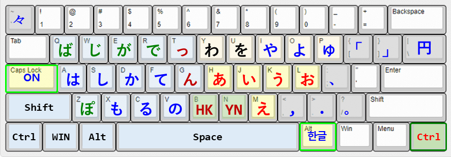
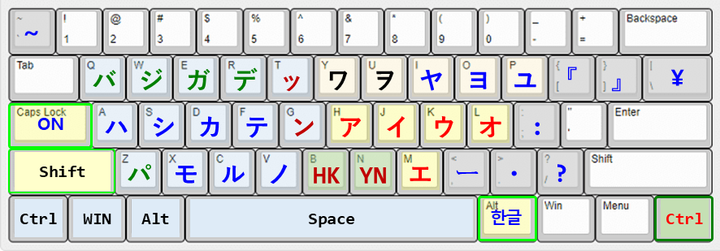

</div>


### 3️⃣ 일본어3_3Layer

1. 트레이 메뉴에서 "일본어3_3Layer" 선택 (한글 입력 모드 + CAPS Lock On)

2. 인체공학적 자판 배치

- 왼손 자음은 50음도의 역방향으로, 오른손 모음은 순방향으로 배열함. 

- 단, 사용빈도를 고려하여 あいうおえ, やよゆ, をわ로 순서를 바꾸어 배열함.

3. 히라가나 문자 배치도

- 3개의 Layer에 76자의 일본어 문자를 사용빈도를 고려하여 모두 배치함.

- **Layer1**: 청음(なまらは) + 비음(ん) + 기본모음(あいう,おえ)

- **Layer2**: 청음(かさた)+반탁음(ぱ) + 촉음[っ] + 모음(やよゆ,をわ)

- **Layer3**: 탁음(がざだば) + V음[ヴ] + 요음(ゃょゅ) + HK키 + YN키

<div align="center">

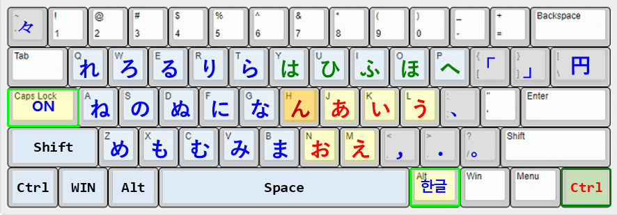
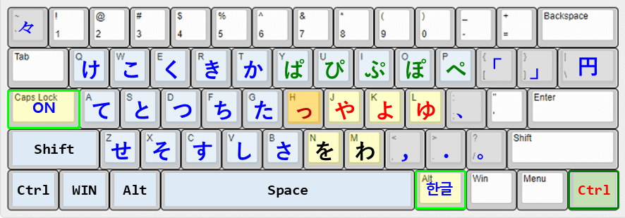
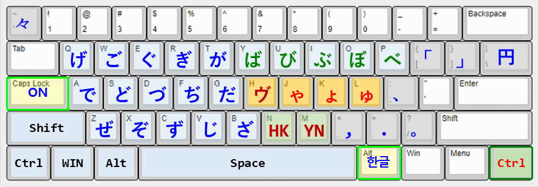

</div>

4. 가타카나 문자 배치도

- 3개의 Layer에 76자의 일본어 문자를 사용빈도를 고려하여 모두 배치함.

- **Layer1**: 청음(ナマラハ) + 비음(ン) + 기본모음(アイウ,オエ)

- **Layer2**: 청음(カサタ)+반탁음(パ) + 촉음[ッ] + 모음(ヤヨユ,ヲワ)

- **Layer3**: 탁음(ガザダバ) + [ィ] + 요음(ャョュ) + HK키 + YN키

<div align="center">

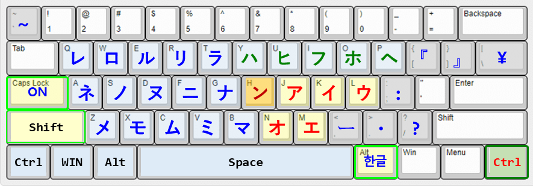
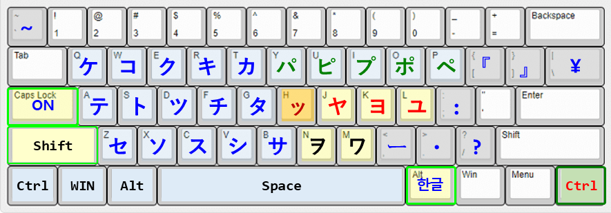
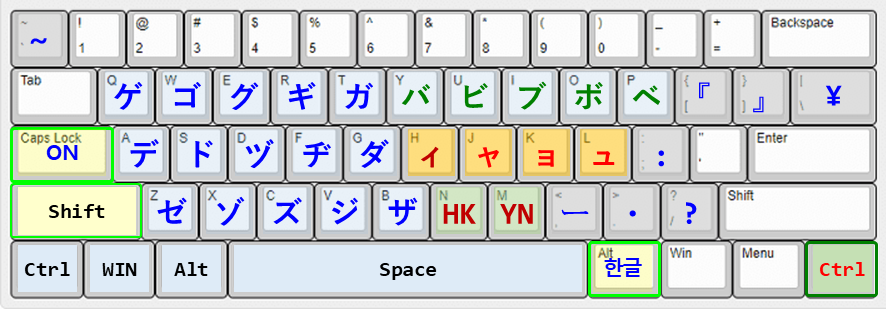

</div>

5. 한자키/HK/YN 전환기능

- **한자키** (RCtrl): 일본어3(Layer1 → Layer2 → Layer3) ↔ 영어소문자 입력모드 전환기능 

- **HK** 전환키(B): 히라가나(H) ↔ 가타카나(K)

- **YN** 전환키(P): 청음 → 탁음 → 반탁음 → 작은글자 → 청음

** 다수의 글자를 선택하고 HK/YN키를 누르면, 첫번째 글자가 전환되는 글자와 동일한 유형으로 글자들이 전환된다.

### 4️⃣ 일본어 한자변환 방법

- 기존 일본어 IME 설치된 경우, 일본어 문자열을 선택하고 Spacebar를 누르면 일본어 한자 변환이 가능하다.

- 일본어 문자열을 입력하고 또는 입력한 문자열을 선택하고, spacebar를 눌러서 일본어 단어를 한자로 변환

- "Mozc 오프라인 한자변환" 선택시, `mozc_dict_connect.db` 파일을 1회 온라인 다운로드 필요함

- mozc_dict_connect.db (SQLite 테이블 내에 BLOB으로 저장) = mozc_dict.db (SQLite3 DB) + conneciton.lib(Binary Short matrix)

- "Google 온라인 한자변환" 선택시, 온라인으로 Google CGI API for Japanese Input 기능을 제공함

- 현재는 가장 단순하고 가벼운 휴리스틱 방식의 일괄 조합 치환 방식을 적용하여 구현함

<div align="center">

| 비교항목 | Mozc 오프라인 한자변환 | Google 온라인 한자변환 |
|:--:|:--:|:--:|
| 변환속도 | 빠름 (10~50ms) | 약간 느림 (50~200ms) |
| 정확도 | 95% (신조어에 약함) | 98% (최신정보 포함) |
| 작동조건 | 사전DB 다운로드 | 네트워크 연결 |

</div>


### 5️⃣ 새로운 일본어 문자 구조 시스템을 고안하여 적용함 

- 3자리 숫자로 자음/모음/형태를 모두 표현함
  - 100 자리 숫자 : 대표자음 10행을 배치함 
  - 010 자리 숫자 : aiueo(히라가나)와 AIUEO(가타카나), 10단을 배치함
  - 001 자리 숫자 : 청음, 탁음, 반탁음, 스테가나 

| 숫자 | 100자리(자음) | 10자리(모음) | 1자리(형태) |
|:--:|:--:|:--:|:--:|
| 0 | a | a | 청음 |
| 1 | k | i | 탁음 |
| 2 | s| u | 반탁음 |
| 3 | t | e | 스테가나 |
| 4 | h | o | - |
| 5 | n | A | - |
| 6 | m | I | - |
| 7 | r | O | - |
| 8 | y | U | - |
| 9 | w | E | - |
  
|＼|모음|a|i|u|e|o|A|I|U|E|O||
|:--:|:--:|:--:|:--:|:--:|:--:|:--:|:--:|:--:|:--:|:--:|:--:|:--:|
|**자음**|＼|あ단|い단|う단|え단|お단|ア단|イ단|ウ단|エ단|オ단|**형태**|
|a|あ행|あ|い|う|え|お|ア|イ|ウ|エ|オ|청음|
|k|か행|か|き|く|け|こ|カ|キ|ク|ケ|コ|청음|
|s|さ행|さ|し|す|せ|そ|サ|シ|ス|セ|ソ|청음|
|t|た행|た|ち|つ|て|と|タ|チ|ツ|テ|ト|청음|
|h|は행|は|ひ|ふ|へ|ほ|ハ|ヒ|フ|ヘ|ホ|청음|
|n|な행|な|に|ぬ|ね|の|ナ|ニ|ヌ|ネ|ノ|청음|
|m|ま행|ま|み|む|め|も|マ|ミ|ム|メ|モ|청음|
|r|ら행|ら|り|る|れ|ろ|ラ|リ|ル|レ|ロ|청음|
|y|や행|や||ゆ||よ|ヤ||ユ||ヨ|청음|
|w|わ행|わ|ゐ|**ん**|ゑ|を|ワ|ヰ|ン|ヱ|ヲ|청음|
|g|が행|が|ぎ|ぐ|げ|ご|ガ|ギ|グ|ゲ|ゴ|탁음|
|z|ざ행|ざ|じ|ず|ぜ|ぞ|ザ|ジ|ズ|ゼ|ゾ|탁음|
|d|だ행|だ|ぢ|づ|で|ど|ダ|ヂ|ヅ|デ|ド|탁음|
|b|ば행|ば|び|ぶ|べ|ぼ|バ|ビ|ブ|ベ|ボ|탁음|
|p|ぱ행|ぱ|ぴ|ぷ|ぺ|ぽ|パ|ピ|プ|ペ|ポ|반탁음|
|v|あ행(V발음)|||ゔ|||||**ヴ**|||탁음|
|xa|あ행|ぁ|ぃ|ぅ|ぇ|ぉ|ァ|ィ|ゥ|ェ|ォ|스테가나|
|xk|か행(箇약자)|ゕ|||ゖ||ヵ|||ヶ||스테가나|
|xt|た행(촉음)|||**っ**|||||ッ|||스테가나|
|xy|や행(요음)|ゃ||ゅ||ょ|ャ||ュ||ョ|스테가나|
|xw|わ행|ゎ|||||ヮ|||||스테가나|

* ん는 1000번에 해당하지만, わ행 빈자리(920)에 배치함
* 스테가나는 영어문자 앞에 "x"를 붙여 표시함
 
|＼|010|0|1|2|3|4|5|6|7|8|9||
|:--:|:--:|:--:|:--:|:--:|:--:|:--:|:--:|:--:|:--:|:--:|:--:|:--:|
|**100**|＼|あ단|い단|う단|え단|お단|ア단|イ단|ウ단|エ단|オ단|**001**|
|0|あ행|000|010|020|030|040|050|060|070|080|090|0|
|1|か행|100|110|120|130|140|150|160|170|180|190|0|
|2|さ행|200|210|220|230|240|250|260|270|280|290|0|
|3|た행|300|310|320|330|340|350|360|370|380|390|0|
|4|は행|400|410|420|430|440|450|460|470|480|490|0|
|5|な행|500|510|520|530|540|550|560|570|580|590|0|
|6|ま행|600|610|620|630|640|650|660|670|680|690|0|
|7|ら행|700|710|720|730|740|750|760|770|780|790|0|
|8|や행|800||820||840|850||870||890|0|
|9|わ행|900|910|920|930|940|950|960|970|980|990|0|
|1|が행|101|111|121|131|141|151|161|171|181|191|1|
|2|ざ행|201|211|221|231|241|251|261|271|281|291|1|
|3|だ행|301|311|321|331|341|351|361|371|381|391|1|
|4|ば행|401|411|421|431|441|451|461|471|481|491|1|
|4|ぱ행|402|412|422|432|442|452|462|472|482|492|2|
|0|あ행(V)|||021|||||071|||1|
|0|あ행|003|013|023|033|043|053|063|073|083|093|3|
|1|か행(箇)|103|||133||153|||183||3|
|3|た행(촉음)|||323|||||373|||3|
|8|や행(요음)|803||823||843|853||873||893|3|
|9|わ행|903|||||953|||||3|

- 3자리 코드의 장점들

  ✅ 메모리: 한 문자 = 2바이트 (ushort)

  ✅ 성능: 산술 연산으로 속성 추출 (나눗셈/나머지)

  ✅ 계산: HK/YN 변환시 빠른 산술 연산 

  ✅ 효율: 대량 문자 처리 시 메모리/CPU 절감


### 6️⃣ 일본어 문자 배치에 참고한 정보

- 65자 기준 5단 사용빈도 순위 : あ단 > お단 > い단 > う단 > え단

- や행 사용빈도 순위 : や > よ > ゆ

- 비음(ん)은 대부분의 글자와 결합하지만, 상대적으로 청음보다 탁음.반탁음과 많이 사용된다.

- 촉음(っ)은 かさたぱ 다음에 받침(K,S,T,P)에 해당하는 소리로, 글자 'つ'를 작게 쓴 'っ'로 표기한다. 

- 촉음(っ)은 주로 청음(かさた), 반탁음(ぱ)과 사용되고, 외래어 표기시 유성음(ガザダバ) 앞에서 ッ도 빈번함.

- 요음(ゃゅょ)은 청음 い단(きしちにひみり)과 많이 결합한다.

- あ행이 스테가나(ステガナ)로 쓰이는 경우는, 외래어 표기(f,t,d,w,ts,v), 한국어의 종성 표현, 만화에서 말끝을 흐릴때 등이다.

- ヴ는 영어 V 발음용으로 탁음기호가 허용된 사례이고, あ행 스테가나(작은글씨)와 조합되어 사용된다.

- ヶ와 ヵ는 箇의 약자 또는 조조사(が) 대용으로 쓰이며, 주로 기간·개수 단위와 고유 지명에 사용된다.

  [빈도출처] 文字の出現頻度 - Wikipedia (平仮名 総数 24,319,649 文字 기반)

<div align="center">

|행구분	|빈도(%)	|단구분	|빈도(%)	|모음+특수	|빈도(%) |
|:---:|:---:|:---:|:---|:---:|:---|
|た행	|16.142	|あ단	|26.177	|あ	|1.366|
|か행	|7.420	|い단	|18.683	|い	|4.857|
|さ행	|8.292	|う단	|16.358	|う	|1.613|
|は행	|4.852	|え단	|13.263	|え	|0.823|
|な행	|16.027	|お단	|19.241	|お	|0.414|
|ら행	|11.298	|や,ゃ	|0.816	|や	|0.652|
|ま행	|5.080	|ゆ,ゅ	|0.208	|ゆ	|0.062|
|だ행	|5.712	|よ,ょ	|0.809	|よ	|0.677|
|が행	|4.407	|わ,ゎ	|0.596	|わ	|0.596|
|ざ행	|0.987	|を	|3.851	|を	|3.851|
|ば행	|1.525	|청음(자음)	|68.078	|ん	|1.978|
|ぱ행	|0.640	|청음(모음)	|15.640	|[っ]	|1.922|
|あ행	|9.361	|탁음	|12.637	|[ィ]	|0.139|
|や행	|1.832	|스테가나	|3.005	|ヴ	|0.005|
|わ행	|4.447	|요음	|0.441	|[ヶ,ヵ]	|0.000|

</div>

### 7️⃣ 아래한글에서 윈도우 MS IME 사용하기

> 📌 [TIP]
> 한글과컴퓨터의 자체 입력기 대신 Microsoft IME를 사용하도록 전환하면, 아래한글에서도 IMEJapanese가 입력 상태를 정확히 표시합니다.

* 아래한글 실행 후 상단 메뉴에서 `도구 ➔ 글자판 ➔ 글자판 바꾸기` 클릭 (단축키: <kbd>Alt</kbd> + <kbd>F2</kbd>)
* **글자판 바꾸기** 창에서 현재 글자판을 **한국어** 대신 **윈도우 입력기**로 변경
* **글자판 자동 변경** 해제하여 항상 윈도우 설정을 따르도록 저장

### 8️⃣ 윈도우 시작 프로그램에 추가하기

* 윈도우 실행창(run)을 띄운다 : <kbd>WIN</kbd> + <kbd>R</kbd>
* 윈도우 시작프로그램 폴더를 연다 : `shell:startup`
* IMEJapanese.exe 바로가기 파일을 생성하여 시작프로그램 폴더에 붙여넣는다
* IMEJapanese 실행 후 숨겨진 아이콘 박스에 포함된 경우, 작업표시줄로 끄집어내어 MS IME 옆에 놓으면 시각적으로 도움이 된다

<br>

## 🏃 초보 개발자를 위한 정보

### ⚙️ 요구 사항

| 항목 | 내용 |
|:---|:---|
| 🖥️ **OS** | Windows 10 / Windows 11 (64-bit) |
| 🧩 **Runtime** | [.NET 10.0 Desktop Runtime](https://dotnet.microsoft.com/download/dotnet/10.0) 이상 |
| ⌨️ **Language** | C# 12 / 13 |
| 🛠️ **IDE** | Visual Studio 2022 / 2026 |

### 1️⃣ 레포지토리 클론

```bash
git clone https://github.com/stonkim93/IMEJapanese.git
```

### 2️⃣ 빌드 & 배포판 만들기

Visual Studio에서 `IMEJapanese.csproj`를 열고 빌드합니다.

#### 프레임워크 의존형 (소용량)

```bash
dotnet publish -c Release -r win-x64 --self-contained false /p:PublishSingleFile=true
```

#### .net10 런타임 포함형 (대용량)

```bash
dotnet publish -c Release -r win-x64 --self-contained true /p:PublishSingleFile=true /p:IncludeNativeLibrariesForSelfExtract=true
```

### 3️⃣ 2가지 실행 파일 다운로드

오른쪽의 **[Releases]** 탭에서 최신 버전의 `.zip` 파일을 다운로드 하고 압축을 해제합니다.

| 파일명 | 용도 | 파일크기(KB) |
|:---|:---|---:|
| [IMEJapanese.zip](https://github.com/stonkim93/IMEJapanese/releases/download/IMEJapanese/IMEJapanese.zip) | dotnet10 미포함 | 492 |
| [IMEJapanese_with_dotnet10.zip](https://github.com/stonkim93/IMEJapanese/releases/download/IMEJapanese/IMEJapanese_with_dotnet10.zip) | dotnet10 포함 | 2976 |


### 4️⃣ 실행하기

`IMEJapanese.exe`를 실행하면 시스템 트레이에서 즉시 작동합니다.

> 📌 [IMPORTANT]
> 중복 실행 방지(`Mutex`)가 내장되어 있어 안전하게 백그라운드에서 상주합니다.

<br>

## ⚡ 기술적 특징 및 최적화 (Technical Highlights)

> 📌 [NOTE]
> 이 앱은 백그라운드에서 365일 실행되어도 시스템에 전혀 무리를 주지 않도록, 초경량·고성능을 목표로 가혹하게 최적화되었습니다.

### 1️⃣ 다중 입력 상태 관리 (Multi-State IME Engine)

* **5가지 입력 상태 추적**
  - 기본 상태: 영어 소/대문자, 한글, 한글CAPS 일본어, 일본어 IME
  - 한글CAPS 모드: 일본어1, 일본어2, 일본어3

* **상태 전환 엔진**: 언어 변경, Caps Lock, 한자키 입력을 감지하여 자동 상태 전환

* **컨텍스트 동기화**: 창 전환 시에도 입력 상태를 정확히 유지

### 2️⃣  문맥을 놓치지 않는 스마트 입력 감지 (Smart Context Tracking)

* **3중 감지 엔진**:
  - ① 하드웨어 키보드 신호 직접 가로채기 (GlobalKeyboardHook)
  - ② 입력창에 직접 상태 질의하기 (IME Query API)
  - ③ 윈도우 레지스트리 상태 확인 (Registry Monitoring)
  - 이를 통해 메모장, 엑셀, 게임, 보안 프로그램 등 어떤 환경에서도 정확한 상태 감지

* **창 포커스 추적**: 바탕화면이나 작업표시줄을 클릭했다가 돌아올 때 **이전 창과 언어 상태를 기억**하고 원래대로 복구

* **특수앱 최적화**: Excel, 아래한글, 게임 등 각 앱의 특성에 맞춘 별도의 감지 로직


### 3️⃣  메모리 낭비 제로, 극한의 성능 최적화 (Zero GC & Resource Management)

* **마우스 끊김 원천 차단 (Zero GC)**:
  - 100ms마다 마우스를 감지하면서도 임시 공간(Stack)만 사용하고 즉시 비워버리는 특수 설계
  - 가비지 컬렉터가 개입할 여지를 없애 **마우스가 단 1ms도 끊기지 않음**

* **컬러 포인터 캐싱**: 자주 사용하는 컬러 포인터를 메모리에 캐시하여 반복 생성 방지

* **완벽한 자원 관리**: 색상이 바뀔 때마다 생성되는 비트맵을 사용 직후 즉시 파괴(`DeleteObject`)하여 메모리 누수 차단

### 4️⃣ 외부 충돌 및 오류에 대비한 철벽 안전망 (Bulletproof Safety)

* **Thread-Safe 설계**: 듀얼 모니터 연결, 해상도 변경 시 발생하는 레이스 컨디션 차단

* **강제 종료 시 자동 복구**: 예기치 못한 에러나 업데이트로 프로그램이 강제 종료되더라도 **윈도우 원래의 하얀색 마우스 커서로 자동 복구**

* **예외 처리**: 모든 주요 진입점에 try-catch 및 finally 블록으로 리소스 누수 방지


<br>


## 💡 몇가지 기술적 난제들

- 아래의 기술적 난제에 대해 도움을 요청합니다.

⚠️ "문자 입력창", "키보드 배열창", "작업표시줄", "트레이 아이콘"의 입력상태를 동기화 했으나, 트레이 메뉴를 선택하기 위해 마우스로 아이콘을 클릭하는 순간, 트레이 아이콘이 문자 입력창의 입력모드에서 영어 소문자(Caps Off일때) 또는 영어 대문자(Caps On일때)의 입력상태로 변한다. [지금은 일정부분 해결했으나 가끔 오작동함]

⚠️ 일본어 모드에서, MS오피스앱(엑셀,워드,파워포인터)이나 한글앱(hwp)에서 일본어 글자를 선택하고 HK/YN키를 누르면, 포인터가 작업중으로 바뀌고, 일정시간 후에 원래의 포인터로 돌아오고, 글자 전환이나 교체가 이루어 지지 않는다. [UI 스레드 블로킹 문제로, UI 스레드 분리 및 UI Automation을 이용하여 해결함]

## ❤️ 개발 후기 및 감사의 글

- GitHub Issues를 통해 버그 리포트, 기능 제안, 풀 리퀘스트를 환영합니다!

- 초기에는 Visual Studio 2026을 사용하여 초기 버전을 개발했고, 지금은 VS code를 사용하고 있습니다.

- Coding & Debugging에는 Gemini 3.1 Pro (무료)의 도움을 많이 받았습니다.

- 키보드 배열 검토에는 Claude Haiku 4.5 (무료)를 활용했습니다. 

## 🏆 Family Apps

- [**IMEPointer**](https://github.com/stonkim93/IMEPointer) : Full Packages.

- [**IMEPali**](https://apps.microsoft.com/detail/9PNFCVSWJNS5?hl=ko-kr&gl=KR&ocid=pdpshare) : Pali input system in the English mode.

- [**IMEJapanese**](https://apps.microsoft.com/detail/9PMHRZSFVCZ2?hl=ko-kr&gl=KR&ocid=pdpshare) : Japanese123 input system in the Korean CAPS mode. 

- [**IMCPointer**](https://apps.microsoft.com/detail/9MX9NMQ6LP3H?hl=ko-kr&gl=KR&ocid=pdpshare) : Color Pointer Only.

## 📜 라이선스 (License)

- 이 프로젝트는 **MIT License**에 따라 자유롭게 수정 및 배포할 수 있습니다.

<br>

❤️🌍✨⚡🚀💡🎯🆕🖥️💻⌨️🔤🎨🧩🐛🔹📐📝✅🏆ℹ️❓
